# Simple Docker

Introduction to docker. Developing a simple docker image for your own server.

## Part 1. Ready-made docker

**== Task ==**

##### Take the official docker image from **nginx** and download it using `docker pull`.

`$ docker pull nginx`

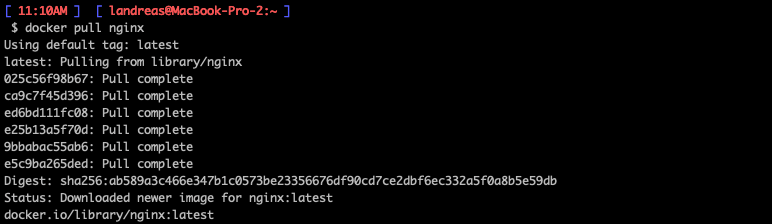

##### Check for the docker image with `docker images`
`$ docker images`

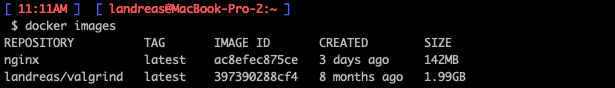

##### Run docker image with `docker run -d [image_id|repository]`
`$ docker run -d [image_id]`

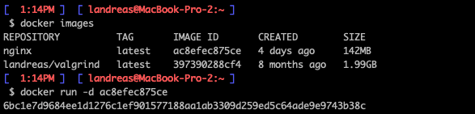

##### Check that the image is running with `docker ps`
`$ docker ps`

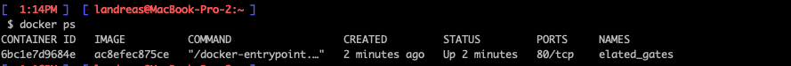

##### View container information with `docker inspect [container_id|container_name]`

`$ docker inspect [image_id]`

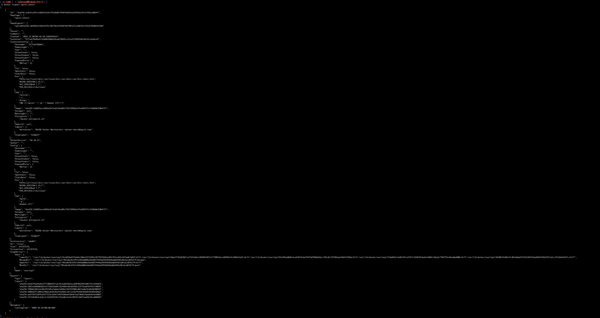

##### From the command output define and write in the report the container size, list of mapped ports and container ip

Or you may use `$ docker container ls -s` to check container parameters

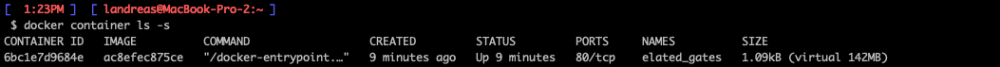

##### Stop docker image with `docker stop [container_id|container_name]`

`$ docker stop [image_id]`

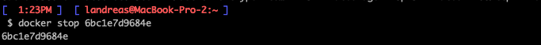

##### Check that the image has stopped with `docker ps`

`$ docker ps`

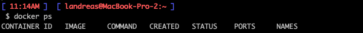

##### Run docker with mapped ports 80 and 443 on the local machine with *run* command

`$ docker run --name my-nginx2 -p 80:80 -p 443:80 -d [image_name]`

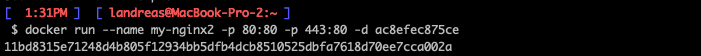

after it you can check which ports it's using

`$ docker container ls -s`

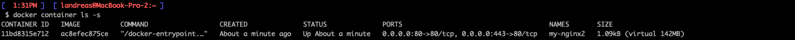

##### Check that the **nginx** start page is available in the browser at *localhost:80*

after all of that you should see the **nginx** start page on [localhost:80](http://localhost:80) and [localhost:443](http://localhost:443) in browser

##### Restart docker container with `docker restart [container_id|container_name]`

`$ docker restart [container_id]`

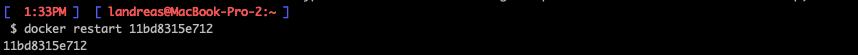

##### Check in any way that the container is running

`$ docker container ls -s`

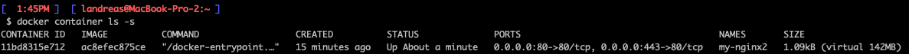

## Part 2. Operations with container

Docker image and container are ready. Now we can look into **nginx** configuration and display page status.

**== Task ==**

##### Read the *nginx.conf* configuration file inside the docker container with the *exec* command

`$ docker exec -it [container_id] /bin/bash`

`# cd etc/nginx`

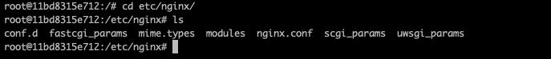

##### Create a *nginx.conf* file on a local machine

`# touch nginx.conf`

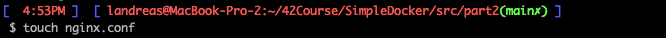

##### Configure it on the */status* path to return the **nginx** server status page

First, you should check, where is nginx status page locates. You can find it in `conf.d/default.conf` in same directory as `nginx.conf`.

`index.html` contains in `/usr/share/ngninx/html` by default

Then copy

    user  nginx;
    worker_processes  auto;

    error_log  /var/log/nginx/error.log notice;
    pid        /var/run/nginx.pid;

    events {
        worker_connections  1024;
    }

    http {
        include       /etc/nginx/mime.types;
        default_type  application/octet-stream;

        log_format  main  '$remote_addr - $remote_user [$time_local] "$request" '
                          '$status $body_bytes_sent "$http_referer" '
                          '"$http_user_agent" "$http_x_forwarded_for"';

        access_log  /var/log/nginx/access.log  main;

        sendfile        on;
        #tcp_nopush     on;

        keepalive_timeout  65;

        include /etc/nginx/default.d/*.conf;

        #gzip  on;
        server {
            listen       80;
            listen  [::]:80;
            server_name  localhost;

        location / {
                root   /usr/share/nginx/html;
        }

            location /status {
                root   /usr/share/nginx/html/;
            stub_status;
                index  index.html;
            allow all;
            }

            error_page   500 502 503 504  /50x.html;
            location = /50x.html {
                    root   /usr/share/nginx/html;
                }

        }

    }

to your `ngnix.conf` file

##### Copy the created *nginx.conf* file inside the docker image using the `docker cp` command

`$ docker cp nginx.conf CONTAINER_ID:path`

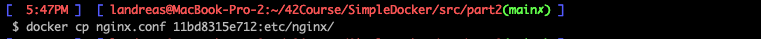

Before you apply changes you can use `# nginx -t` in container to check them.

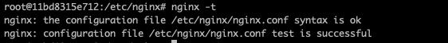

##### Restart **nginx** inside the docker image with *exec*

Then you can use 

`$ docker exec -it [container_id] nginx -s reload`

##### Check that *localhost:80/status* returns the **nginx** server status page

Afeter reloading you shoul see on [localhost:80/status](http://localhost:80/status) this content:

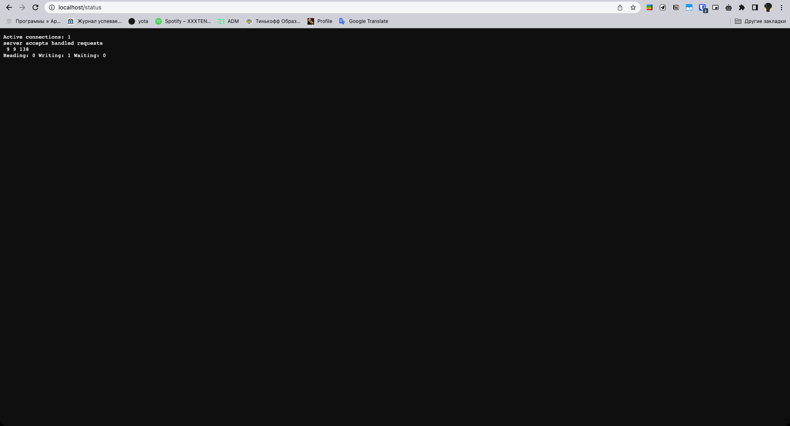

##### Export the container to a *container.tar* file with the *export* command

`$ docker export CONTAINER_ID > filename.tar`

##### Stop the container

`$ docker stop CONTAINER_ID`

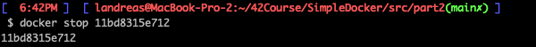

##### Delete the image with `docker rmi [image_id|repository]`without removing the container first

`$ docker image ls` to show list of installed images

`$ docker rmi -f IMAGE_ID`

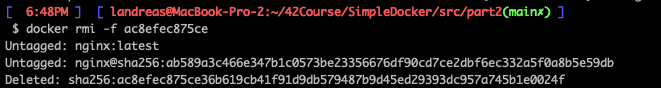

##### Delete stopped container

`$ docker ps -a` list of all containers

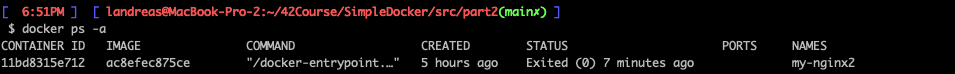

`$ docker rm CONTAINER_ID`

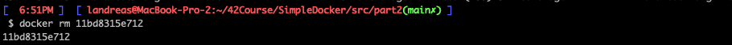

##### Import the container back using the *import*command

`$ docker import filename.tar`

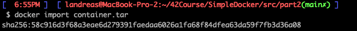

##### Run the imported container
##### Check that *localhost:80/status* returns the **nginx** server status page

- Add the following screenshots to the report:
    - the call and output of all commands used in this part of the task;
    - the contents of the created *nginx.conf* file;
    - the **nginx** server status page at *localhost:80/status*.

## Part 3. Mini web server

It's time to take a little break from the docker to prepare for the last stage. It's time to write your own server.

**== Task ==**

##### Write a mini server in **C** and **FastCgi** that will return a simple page saying `Hello World!`
##### Run the written mini server via *spawn-fcgi* on port 8080
##### Write your own *nginx.conf* that will proxy all requests from port 81 to *127.0.0.1:8080*
##### Check that browser on *localhost:81* returns the page you wrote
##### Put the *nginx.conf* file under *./nginx/nginx.conf* (you will need this later)

## Part 4. Your own docker

Now everything is ready. You can start writing the docker image for the created server.

**== Task ==**

*When writing a docker image avoid multiple calls of RUN instructions*

#### Write your own docker image that:
##### 1) builds mini server sources on FastCgi from [Part 3](#part-3-mini- web-server)
##### 2) runs it on port 8080
##### 3) copies inside the image written *./nginx/nginx.conf*
##### 4) runs **nginx**.
_**nginx** can be installed inside the docker itself, or you can use a ready-made image with **nginx** as base._
##### Build the written docker image with `docker build`, specifying the name and tag
##### Check with `docker images` that everything is built correctly
##### Run the built docker image by mapping port 81 to 80 on the local machine and mapping the *./nginx* folder inside the container to the address where the **nginx** configuration files are located (see [Part 2](#part-2-operations-with
-container))
##### Check that the page of the written mini server is available on localhost:80
##### Add proxying of */status* page in *./nginx/nginx.conf* to return the **nginx** Яserver status
##### Restart docker image
*If everything is done correctly, after saving the file and restarting the container, the configuration file inside the docker image should update itself without any extra steps
##### Check that *localhost:80/status* now returns a page with **nginx** status

## Part 5. **Dockle**

Once you've written the image, it's never a bad idea to check it for security.

**== Task ==**

##### Check the image from the previous task with `dockle [image_id|repository]`
##### Fix the image so that there are no errors or warnings when checking with **dockle**

## Part 6. Basic **Docker Compose**

There, you've finished your warm-up. Wait a minute though...
Why not try experimenting with deploying a project consisting of several docker images at once?

**== Task ==**

##### Write a *docker-compose.yml* file, using which:
##### 1) Start the docker container from [Part 5](#part-5-dockle) _(it must work on local network, i.e., you don't need to use **EXPOSE** instruction and map ports to local machine)_
##### 2) Start the docker container with **nginx** which will proxy all requests from port 8080 to port 81 of the first container
##### Map port 8080 of the second container to port 80 of the local machine
##### Stop all running containers
##### Build and run the project with the `docker-compose build` and `docker-compose up` commands
##### Check that the browser returns the page you wrote on *localhost:80* as before

💡 [Tap here](https://forms.yandex.ru/u/6357f52902848f350b554d5f/) **to leave your feedback on the project**. Pedago Team really tries to make your educational experience better.
